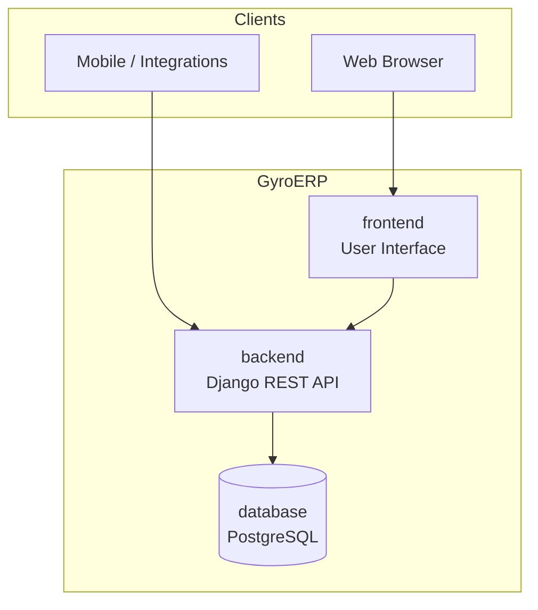

<div align="center">

# GyroERP

### Modern ERP for global businesses

**Built with transparency. Designed for scale. Created by Muhammad Ahsan.**

[](https://github.com/GyroERP/backend/actions/workflows/ci.yml)
[](https://github.com/GyroERP/frontend/actions/workflows/ci.yml)
[](https://github.com/GyroERP/database/actions/workflows/ci.yml)


[Repositories](#-repositories) ·
[Architecture](#-architecture) ·
[Technology](#-technology) ·
[Roadmap](#-roadmap) ·
[Get Started](#-get-started) ·
[Community](#-community) ·
[License](#-license)

</div>

---

## About GyroERP

**GyroERP** is a next-generation **Enterprise Resource Planning (ERP)** platform for organizations that need unified control over inventory, finance, operations, and business workflows — without sacrificing transparency or long-term ownership of their data.

The project is **source-available** and organized as a **modular monorepo across three focused repositories**, so teams worldwide can develop, deploy, and scale each layer independently.

### Why GyroERP?

| Principle | What it means for you |
|-----------|------------------------|
| **Modular by design** | Backend, frontend, and database evolve on separate release cycles |
| **API-first** | Integrate with existing tools, mobile apps, and third-party services |
| **Global-ready** | Built for international teams — timezones, localization, and scalable deployments |
| **Transparent governance** | Public code visibility with clear licensing and contribution terms |
| **Enterprise discipline** | Branch protection, CI checks, security policy, and structured reviews |

---

## Repositories

| Repository | Role | Stack | Explore |
|------------|------|-------|---------|
| [**backend**](https://github.com/GyroERP/backend) | REST API, business logic, authentication, admin | Python · Django 5.2 · DRF · PostgreSQL | [README](https://github.com/GyroERP/backend#readme) · [API health](https://github.com/GyroERP/backend#quick-start-local) |
| [**frontend**](https://github.com/GyroERP/frontend) | Web UI for operators, managers, and administrators | Modern web stack *(in development)* | [README](https://github.com/GyroERP/frontend#readme) |
| [**database**](https://github.com/GyroERP/database) | Schemas, migrations, seeds, and data assets | PostgreSQL · SQL migrations | [README](https://github.com/GyroERP/database#readme) |
| [**.github**](https://github.com/GyroERP/.github) | Organization profile and shared community defaults | Markdown · GitHub Actions | [Profile](https://github.com/GyroERP/.github/tree/main/profile) |

---

## Architecture

GyroERP follows a **decoupled, API-driven architecture** so each component can be deployed, scaled, and maintained independently.



**Data flow**

1. Users interact with the **frontend** for day-to-day ERP operations.
2. The **backend** enforces business rules, permissions, and audit logic.
3. The **database** repository holds canonical schemas and migration history.

---

## Technology

<table>
<tr>
<td width="50%" valign="top">

### Backend
- Python 3.12+
- Django 5.2 + Django REST Framework
- PostgreSQL (production) / SQLite (local dev)
- Docker & Docker Compose
- Ruff, pytest, GitHub Actions CI

</td>
<td width="50%" valign="top">

### Platform & DevOps
- Protected `main` branches on all repos
- Required CI checks before merge
- Dependabot for dependency updates
- Security disclosure policy
- Contributor Covenant Code of Conduct

</td>
</tr>
</table>

---

## Roadmap

GyroERP is in **active development**. Planned core modules include:

| Module | Capabilities |
|--------|----------------|
| **Inventory** | Products, warehouses, stock movements, reorder rules |
| **Sales** | Quotes, orders, invoicing, customer management |
| **Purchasing** | Suppliers, purchase orders, goods receipt |
| **Finance** | Chart of accounts, journals, payments, reporting |
| **Operations** | Workflows, approvals, audit trails |
| **Administration** | Users, roles, permissions (RBAC), multi-company support |

Track progress in each repository’s [CHANGELOG](https://github.com/GyroERP/backend/blob/main/CHANGELOG.md) and [Issues](https://github.com/GyroERP/backend/issues).

---

## Get Started

### Clone the platform

```bash
# Backend API
git clone https://github.com/GyroERP/backend.git

# Frontend (UI)
git clone https://github.com/GyroERP/frontend.git

# Database assets
git clone https://github.com/GyroERP/database.git
```

### Run the backend locally

```bash
cd backend
python -m venv .venv
source .venv/bin/activate          # Windows: .venv\Scripts\activate
pip install -r requirements-dev.txt
cp .env.example .env               # Set DJANGO_SECRET_KEY
python manage.py migrate
python manage.py runserver
```

Health check: `http://127.0.0.1:8000/health/`

Full setup guide → [backend README](https://github.com/GyroERP/backend#quick-start-local)

---

## Community

We welcome thoughtful contributions that align with our license and code of conduct.

| Resource | Link |
|----------|------|
| **Project board** | [**GyroERP Development**](https://github.com/orgs/GyroERP/projects/2) |
| Ticket workflow | [PROJECT.md](https://github.com/GyroERP/.github/blob/main/PROJECT.md) |
| Contributing | [CONTRIBUTING.md](https://github.com/GyroERP/backend/blob/main/CONTRIBUTING.md) |
| Code of Conduct | [CODE_OF_CONDUCT.md](https://github.com/GyroERP/backend/blob/main/CODE_OF_CONDUCT.md) |
| Security policy | [SECURITY.md](https://github.com/GyroERP/backend/blob/main/SECURITY.md) |
| Support | [SUPPORT.md](https://github.com/GyroERP/backend/blob/main/SUPPORT.md) |
| New ticket | [Bug · Feature · Task · Epic](https://github.com/GyroERP/backend/issues/new/choose) |

**Standard workflow:** issue template → project board → branch → PR → CI → review → merge.

---

## License

GyroERP is **source-available** under the [GyroERP Community License](https://github.com/GyroERP/backend/blob/main/LICENSE).

> This is not an OSI-approved open-source license. Public repository access is provided for **transparency, evaluation, and community collaboration** — not for unrestricted commercial exploitation.

| Purpose | Contact |
|---------|---------|
| Commercial licensing & SaaS | [licensing@gyroerp.com](mailto:licensing@gyroerp.com) |
| Security vulnerabilities | [security@gyroerp.com](mailto:security@gyroerp.com) |
| Legal & trademarks | [legal@gyroerp.com](mailto:legal@gyroerp.com) |

See also [COPYRIGHT.md](https://github.com/GyroERP/backend/blob/main/COPYRIGHT.md) · [TRADEMARKS.md](https://github.com/GyroERP/backend/blob/main/TRADEMARKS.md) · [NOTICE](https://github.com/GyroERP/backend/blob/main/NOTICE)

---

## Founder

<div align="center">

### Muhammad Ahsan

Creator and founder of **GyroERP**

Building enterprise-grade tools with clarity, discipline, and a global perspective.

[](https://github.com/TheodoreAsher)

</div>

---

<div align="center">

**If GyroERP aligns with your vision, star our repositories to follow the journey.**

⭐ [backend](https://github.com/GyroERP/backend) · [frontend](https://github.com/GyroERP/frontend) · [database](https://github.com/GyroERP/database)

*GyroERP — structured operations for the modern enterprise.*

</div>
